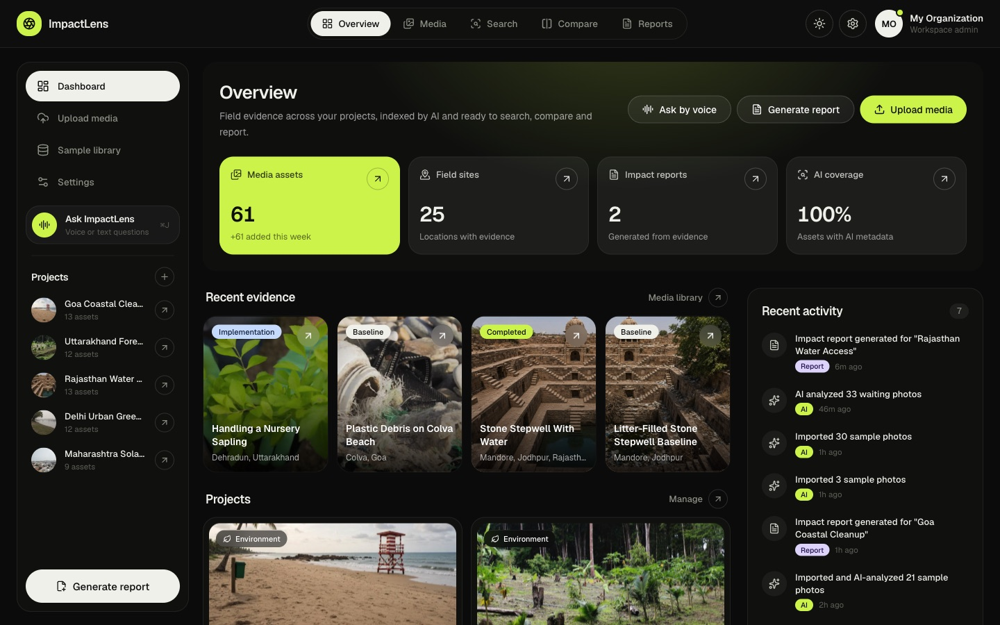
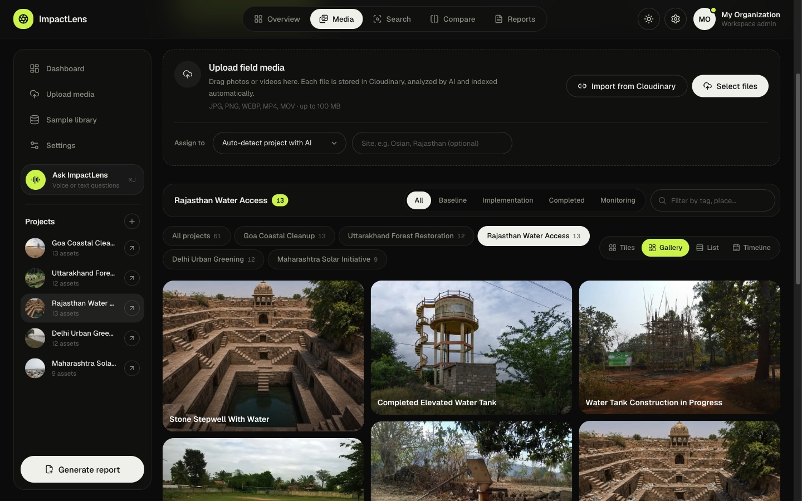
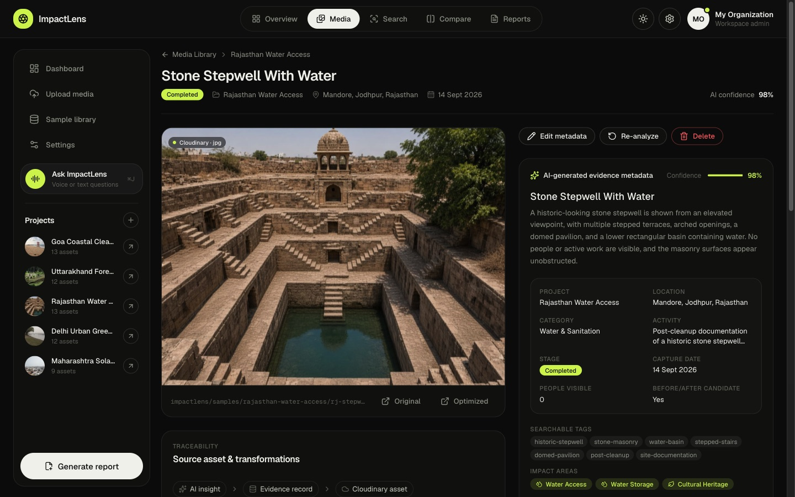
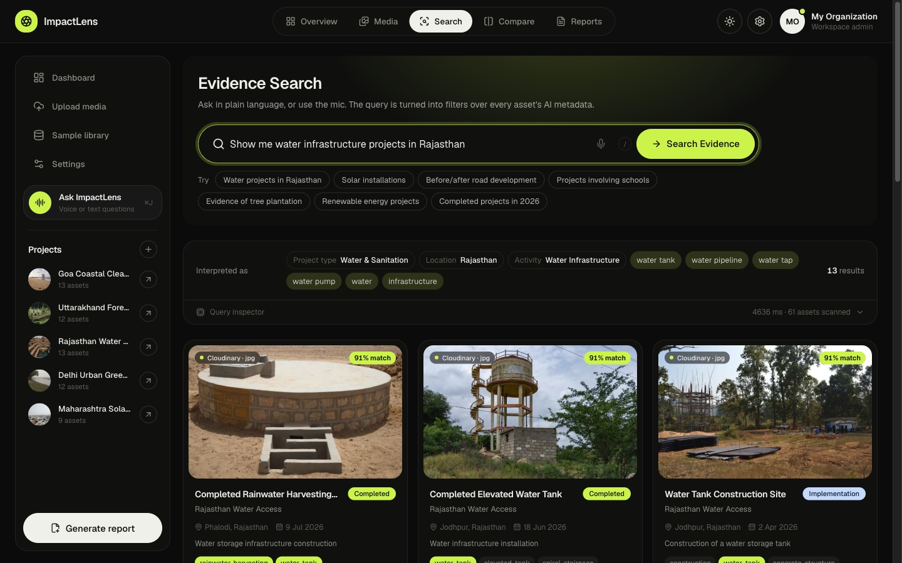
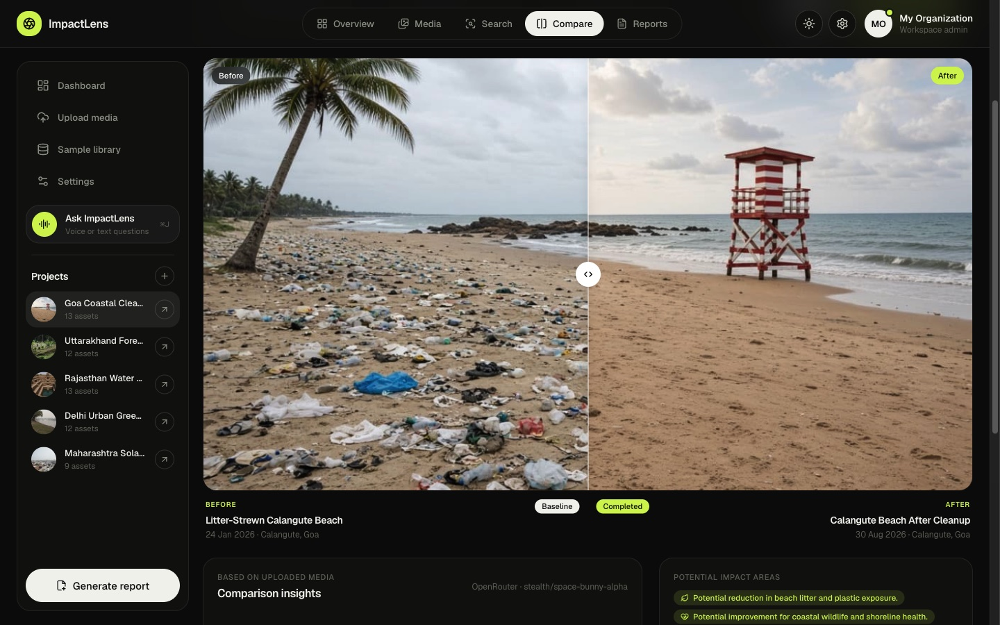
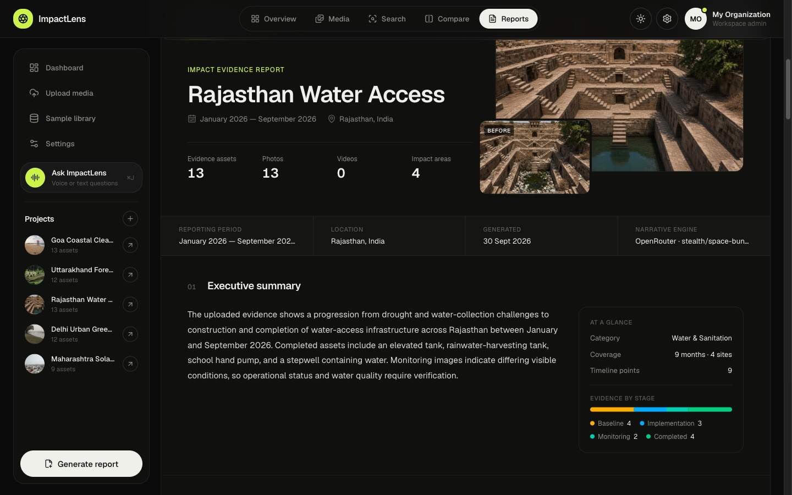
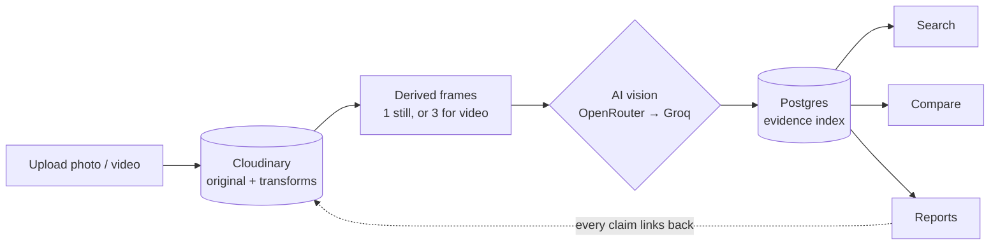

<div align="center">

# ImpactLens

**Turn field photos and videos into searchable, traceable impact evidence.**

ImpactLens stores every piece of field media in Cloudinary, has a vision model describe what it actually shows, and turns the result into evidence you can search in plain language, compare before and after, and compile into reports where every claim links back to the original file.




Created by **Team Phoenix** · Prince Pal · Vansh Singla · Dev Garg

</div>

---

## Why

NGOs, CSR teams and sustainability programmes collect thousands of field photos and clips: a village before a water tank was built, a beach before and after a cleanup, saplings six months after planting. Most of it ends up scattered across phones, WhatsApp groups and shared drives. When a funder asks *"show me what changed in Rajasthan this year"*, someone spends days digging through folders.

ImpactLens makes that media useful:

- **Upload once.** Originals go to Cloudinary untouched; the AI reads each photo or video and writes the title, description, tags, project stage and impact areas.
- **Find anything.** Ask *"water projects completed in Rajasthan after January"* and get ranked results with an explanation of how the query was understood.
- **Prove change.** Put a baseline and a later photo side by side, or on a slider, and get an AI description of what visibly changed.
- **Report honestly.** Generate an impact report where every sentence cites the evidence it came from, and nothing beyond what's visible is claimed.

## Features

| | |
| --- | --- |
| **Media library**<br>Drag in photos or videos (JPG, PNG, WEBP, MP4, MOV, up to 100 MB) or import an existing Cloudinary URL. Browse as tiles, a masonry gallery, a sortable list or a timeline, filtered by project, stage or tag. |  |
| **AI evidence record**<br>Each asset gets AI-written metadata with a confidence score, plus a traceability chain: AI insight, then evidence record, then Cloudinary asset, then the original file. Edit the tags by hand or re-run the analysis at any time. |  |
| **Natural-language search**<br>Queries become structured filters (project type, location, activity, stage, dates) over every asset's AI metadata, and results are ranked by relevance. Press `/` or `⌘K` to search from anywhere, or use the mic. |  |
| **Before and after compare**<br>Pick two assets from the same site and view them side by side or on a drag slider. **Compare** asks the AI to list observed changes, potential impact areas and a confidence score. Results are cached per pair. |  |
| **Impact reports**<br>Choose a project and a date range to get an executive summary, an evidence timeline, a before-and-after section, impact areas, key evidence and AI insights, all citing their source assets. Share a link or export a clean PDF. |  |

**Also included:**

- **Ask ImpactLens** (`⌘J`): a voice or text assistant that answers questions about your evidence, shows matching media and can take you to the right page.
- **Sample library**: 59 ready-made assets across five Indian programmes (water access, urban greening, solar, coastal cleanup, forest restoration). They're imported into your own Cloudinary account and analysed for real.
- **Resilient AI queue**: if every AI provider is busy, uploads still succeed and a background worker analyses them later, giving way to anything you're actively doing.
- Light and dark themes, loading skeletons, lazy-loaded responsive images, and per-route rate limiting.

## How it works



1. **Store.** The browser uploads the file straight to Cloudinary with a server-signed request (so large videos never pass through the app server), keeping EXIF data so capture dates are read automatically.
2. **Analyse.** The AI never sees a re-upload, only Cloudinary-derived frames: one 1024 px JPEG for a photo, or three stills at 15%, 50% and 85% of a video, sent in time order so the model can describe how the scene changes.
3. **Index.** The metadata is normalised to a fixed schema (title, description, activity, stage, tags, impact areas, people visible, confidence) and saved in Postgres through Prisma.
4. **Use.** Search, compare and reports all run on that index and always link back to the Cloudinary original.

## Quick start

Requires **Node.js 22.12+** and a Postgres database. A free [Neon](https://neon.tech) project works well.

```bash
git clone https://github.com/princepal-dev/impactlens.git
cd impactlens
npm install                  # also generates the Prisma client
cp .env.example .env         # add your keys, see below
npm run db:deploy            # create the tables
npm run dev                  # http://localhost:3000
```

Then open **Sample library** to import the demo evidence, or drag your own photos into **Media**.

### Environment variables

| Variable | Required | Notes |
| --- | --- | --- |
| `DATABASE_URL` | Yes | Postgres connection string. On Neon, use the **pooled** one (host contains `-pooler`). |
| `DIRECT_URL` | No | Non-pooled connection string for `prisma migrate`. Falls back to `DATABASE_URL`. |
| `NEXT_PUBLIC_CLOUDINARY_CLOUD_NAME` | Yes | [Cloudinary console](https://console.cloudinary.com/), under Settings → API Keys |
| `CLOUDINARY_API_KEY`, `CLOUDINARY_API_SECRET` | Yes* | Used for signed uploads. *Alternatively set `NEXT_PUBLIC_CLOUDINARY_UPLOAD_PRESET` for unsigned uploads, which loses EXIF dates. |
| `CLOUDINARY_FOLDER` | No | Defaults to `impactlens` |
| `OPENROUTER_API_KEY` | At least one AI key | [openrouter.ai/keys](https://openrouter.ai/keys). The main provider, using free models only. |
| `GROQ_API_KEY` | At least one AI key | [console.groq.com/keys](https://console.groq.com/keys). The fallback, using free-tier vision models. |
| `OPENROUTER_MODEL`, `GROQ_MODEL` | No | Model to try first. Paid OpenRouter IDs are ignored. |
| `AI_PROVIDERS` | No | Provider order, defaults to `openrouter,groq` |
| `CRON_SECRET` | In production | Protects `/api/cron/reanalyze`. Vercel sends it automatically to its cron jobs. |

`GET /api/health` reports whether the database, storage and AI providers are reachable.

## AI providers

ImpactLens runs entirely on **free** model tiers, and paid models are never called.

- **OpenRouter (main).** It tries a curated list of free vision models, led by `stealth/space-bunny-alpha` (which doesn't count against the daily free quota), followed by Gemma 4, Nemotron 3, Qwen 3.8, dots-3, Inkling, Ling, Laguna and North. Models are sent three per request (OpenRouter's fallback limit), with `openrouter/free` as the last resort. A model is only called if the live catalogue prices it at zero.
- **Groq (fallback).** It takes over when OpenRouter is down or rate-limited, picking an enabled vision model automatically and re-checking the model list when it looks stale.
- **Failure handling.** When a provider says *"try again in 12s"*, that exact wait is honoured. A rate-limited provider hands over to the next one immediately. A provider whose key is rejected is skipped for 10 minutes, and when the daily quota runs out it pauses until the reported reset.
- **Priority.** Requests you're waiting on always go first, and background re-analysis waits until the app has been quiet for 30 seconds.
- **Video.** Clips are analysed from three frames. Native video input on OpenRouter needs an account balance of at least $1, and Groq accepts images only.

## Cloudinary transformations

| Use | Transformation |
| --- | --- |
| Card thumbnails | `c_fill,g_auto,w_640,h_420,f_auto,q_auto` (smart crop keeps the subject) |
| Responsive images | the same transformation at 0.5×, 1× and 1.5× for `srcSet` |
| Full display | `c_limit,w_1600,f_auto,q_auto` |
| Video playback / poster | `q_auto,f_auto:video` / `so_50p,c_fill,g_auto,…` |
| AI frame (photo) | `c_limit,w_1024,f_jpg,q_auto` |
| AI frames (video) | `so_15p` / `so_50p` / `so_85p` at `c_limit,w_1024` |

Every evidence page lists the public ID, the original URL and each derived URL, so any image in a report can be traced back to its unmodified source.

## API

| Route | Purpose |
| --- | --- |
| `POST /api/upload/sign` | Signed parameters for a direct browser-to-Cloudinary upload |
| `POST /api/upload` | JSON `{ cloudinary, filename, projectId?, location? }` registers a direct upload (verified with Cloudinary); JSON `{ url }` imports; multipart `file` for small server-side uploads. Creates a pending asset. |
| `POST /api/analyze` | `{ assetId }` runs AI analysis; `{ assetId, metadata }` saves manual tags |
| `GET · PATCH · DELETE /api/assets/[id]` | Read, edit or delete an asset (`GET /api/assets` lists them) |
| `POST /api/search` | `{ query }` returns interpreted filters and ranked results |
| `POST /api/compare` | `{ beforeId, afterId }` returns the AI visual change analysis |
| `POST · GET · DELETE /api/report` | Generate, fetch (`?id=`) or delete impact reports |
| `POST /api/assistant` | Conversation turns in, answer plus matching assets and a suggested page out |
| `GET · POST /api/projects`, `PATCH · DELETE /api/projects/[id]` | Manage projects |
| `GET · POST /api/samples` | Sample import status; import one sample |
| `GET · POST /api/reanalyze` | Background analysis queue status; start processing |
| `GET /api/cron/reanalyze` | Scheduled catch-up of pending analyses (Vercel cron, `Bearer $CRON_SECRET`) |
| `GET /api/stats`, `GET /api/health` | Dashboard numbers; service health |

## Project structure

```
prisma/
├── schema.prisma        # projects, media_assets, reports, activity
└── migrations/
scripts/import-sqlite.ts # one-off import from the old SQLite file
src/
├── app/                 # Next.js App Router pages + API routes
│   ├── api/             # upload, analyze, search, compare, report, assistant, …
│   ├── media/           # library and evidence detail pages
│   ├── search/  compare/  reports/  samples/  settings/
│   └── page.tsx         # overview dashboard
├── components/          # UI (MediaLibrary, CompareWorkspace, ReportPreview, VoiceAgent, …)
│   └── ui/              # primitives: button, dialog, panel, smooth-image, …
└── lib/
    ├── ai.ts            # provider chain, retries, rate-limit handling
    ├── analyze.ts       # vision prompt + metadata normalisation
    ├── search.ts        # query interpretation + ranking
    ├── compare.ts       # before/after analysis
    ├── report.ts        # report builder
    ├── reanalyze.ts     # background analysis worker
    ├── cloudinary.ts    # uploads
    ├── media-url.ts     # transformation URLs
    ├── samples.ts       # sample library manifest
    └── store.ts, db.ts  # Prisma persistence (Postgres)
```

## Scripts

| Command | What it does |
| --- | --- |
| `npm run dev` | Start the dev server on port 3000 |
| `npm run build` then `npm start` | Production build and server |
| `npm run lint` | ESLint |
| `npm run db:deploy` | Apply pending Prisma migrations |
| `npm run db:migrate` | Create a new migration after editing `schema.prisma` (development) |
| `npm run db:studio` | Browse the database in Prisma Studio |
| `npm run db:import-sqlite [path]` | Copy data from an old `.data/impactlens.db` into Postgres (idempotent) |

## Deploy on Vercel

1. Import the repository in Vercel. The framework is detected as Next.js.
2. Add the environment variables: `DATABASE_URL` (pooled), `DIRECT_URL` (direct), `CRON_SECRET`, the Cloudinary keys and at least one AI key. The [Neon integration](https://vercel.com/integrations/neon) can fill in the database variables for you.
3. Deploy. The `vercel-build` script runs `prisma generate`, then `prisma migrate deploy`, then `next build`, so the schema is always up to date.

Built for serverless:

- **Uploads** go straight from the browser to Cloudinary, so Vercel's 4.5 MB request limit doesn't apply and 100 MB videos work.
- **Background analysis** runs after the response via `after()`, and a daily cron (`vercel.json`) picks up anything left pending. Analyses interrupted mid-way are retried automatically after 10 minutes.
- **Sample files** in `public/samples` are bundled with the samples function.

Rate limits and AI provider cooldowns are kept in memory, so on Vercel they apply per function instance.

## Responsible AI

- The analysis prompt only describes what is **visible** in the frame.
- ImpactLens never invents beneficiary counts, litres, tonnes or kWh.
- Reports use cautious wording (*"visual evidence suggests…"*) and include a **Needs additional verification** section for anything imagery can't prove.
- Locations come from the uploader or visible context, not verified GPS, and reports say so.

## Team

Created by **Team Phoenix**:

- Prince Pal
- Vansh Singla
- Dev Garg

## Credits

- Bundled field photos: Wikimedia Commons contributors.
- Unsplash samples: credited photographers, linked from each asset.
- Video samples: [Mixkit](https://mixkit.co) (free licence).
- The six same-angle before and after cleanup images (Calangute, Yamuna Ghat, Mandore stepwell) are AI-generated illustrations for demonstrating the compare feature.
